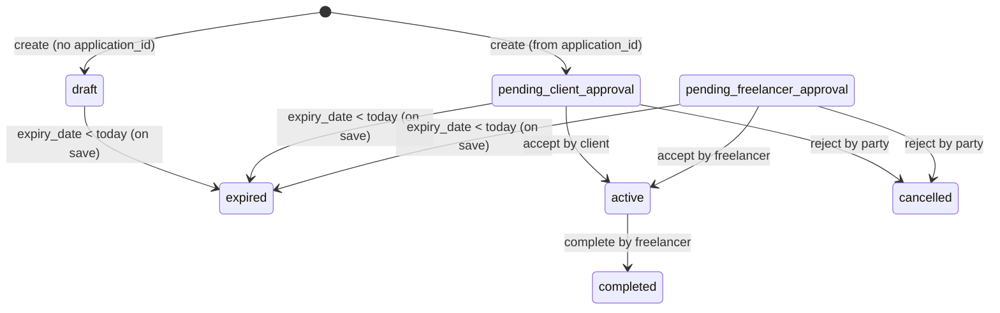

# AssuredGig Backend — Contract state machine

This document describes the **implemented** contract and milestone lifecycle (what the backend currently enforces) for the **Node** service:

- Data model: `prisma/schema.prisma` (`Contract`, `ContractMilestone`, `ContractUpdateHistory`, …)
- HTTP handlers and transitions: `src/routes/contracts.js`
- Automatic expiry for pre-active statuses (when `expiryDate` is before today, local calendar day): `src/utils/contractExpiry.js`

Legacy Django references (`contracts/models.py`, serializers, views) are superseded by the files above.

## Contract statuses

`Contract.status` (Prisma) can be one of:

- `draft`
- `pending_client_approval`
- `pending_freelancer_approval`
- `active`
- `completed`
- `disputed`
- `cancelled`
- `expired`

## Contract lifecycle (implemented transitions)

### Create

From `POST /api/v1/contracts/create/`:

- **Create from application** (request includes `application_id`)
  - Sets `status = "pending_client_approval"`
  - Parties are derived from the application + gig:
    - `client = application.gig_id.client`
    - `freelancer = application.freelancer`
- **Create without application** (no `application_id`)
  - Sets `status = "draft"`
  - Currently sets both `client` and `freelancer` to the request user (placeholder draft behavior).

### Accept

`POST /api/v1/contracts/<uuid>/accept/`

- If **client** accepts:
  - Allowed only when `status == "pending_client_approval"`
  - Sets `status = "active"`
  - Sets `client_approved_at = now()`
- If **freelancer** accepts:
  - Allowed only when `status == "pending_freelancer_approval"`
  - Sets `status = "active"`
  - Sets `freelancer_approved_at = now()`

Important:

- The current flow does **not** include a transition that sets `pending_freelancer_approval` after client acceptance (or vice versa). As written, acceptance immediately activates the contract.

### Reject

`POST /api/v1/contracts/<uuid>/reject/`

- Allowed only for contract parties (client/freelancer)
- Intended by serializer: only when status is pending approval
- Transition:
  - Sets `status = "cancelled"`

### Complete

`POST /api/v1/contracts/<uuid>/complete/`

- Allowed only when `status == "active"`
- **Only freelancer can complete** (enforced by `ContractCompleteSerializer.validate`)
- Transition:
  - Sets `status = "completed"`
  - Sets `completed_at = now()`
  - Sets `progress_percentage = 100`
  - If linked to an application, sets `application.status = "FINISHED"`

### Expire (automatic)

Contracts in `draft` / `pending_client_approval` / `pending_freelancer_approval` are moved to `expired` when loaded or when party-wide expiry is applied (list/stats), if the contract’s `expiryDate` (calendar day) is before today.

Transition:

- Sets `status = "expired"`

## Draft change requests (ContractUpdateHistory-based)

Draft “change requests” are represented by `contracts.ContractUpdateHistory` rows with:

- `update_type = "contract_draft_created"`
- `approval_status = "pending" | "approved" | "rejected" | "cancelled"`

Endpoints:

- `GET /api/v1/contracts/<uuid>/draft/` (fetch latest pending draft)
- `POST /api/v1/contracts/<uuid>/create-draft/` (create pending draft)
- `POST /api/v1/contracts/<uuid>/approve-draft/` (other party approves; applies draft fields to contract)
- `POST /api/v1/contracts/<uuid>/reject-draft/` (other party rejects)
- `POST /api/v1/contracts/<uuid>/cancel-draft/` (creator cancels)

Notes:

- There can only be **one pending draft** at a time (enforced by `create-draft`; scoped to `updateType = "contract_draft_created"`).
- Approving a draft applies snake_case fields from `draftData` (for example `title`, `services_offered`, `expiry_date`) to the contract, and **replaces milestones** when `draftMilestones` or `draftData.milestones` is a non-empty array (existing milestones are deleted and recreated). The response includes the updated serialized contract.

## Milestone state machine (implemented transitions)

Milestone statuses (`contracts.ContractMilestone.status`):

- `pending`
- `in_progress`
- `completed`
- `approved`
- `rejected` (declared in model, but current endpoints do not set `rejected`; rejection sets milestone back to `in_progress`)

Transitions:

- Freelancer marks complete:
  - `POST /api/v1/contracts/<uuid>/milestones/<milestone_uuid>/complete/`
  - Allowed only if contract `status == "active"` and requester is the **freelancer**
  - Allowed from: `pending` or `in_progress`
  - Sets: `status = "completed"`, `completed_at = now()`

- Client approves:
  - `POST /api/v1/contracts/<uuid>/milestones/<milestone_uuid>/approve/`
  - Allowed only if contract `status == "active"` and requester is the **client**
  - Allowed from: `completed`
  - Sets: `status = "approved"`, `approved_at = now()`, `approved_by = client`

- Client rejects (sends back to in-progress):
  - `POST /api/v1/contracts/<uuid>/milestones/<milestone_uuid>/reject/`
  - Allowed only if contract `status == "active"` and requester is the **client**
  - Uses the same serializer as approve (no explicit “only completed” check here)
  - Sets: `status = "in_progress"`, `completed_at = null`

## Mermaid overview

